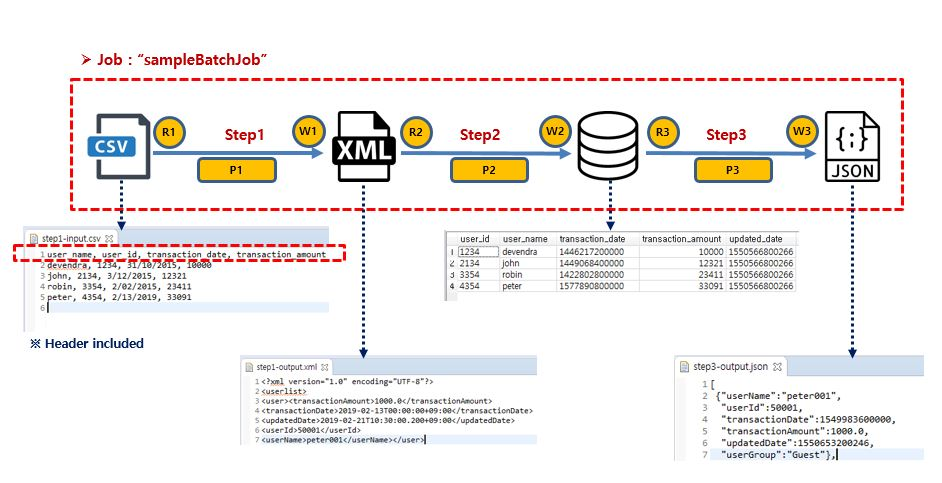
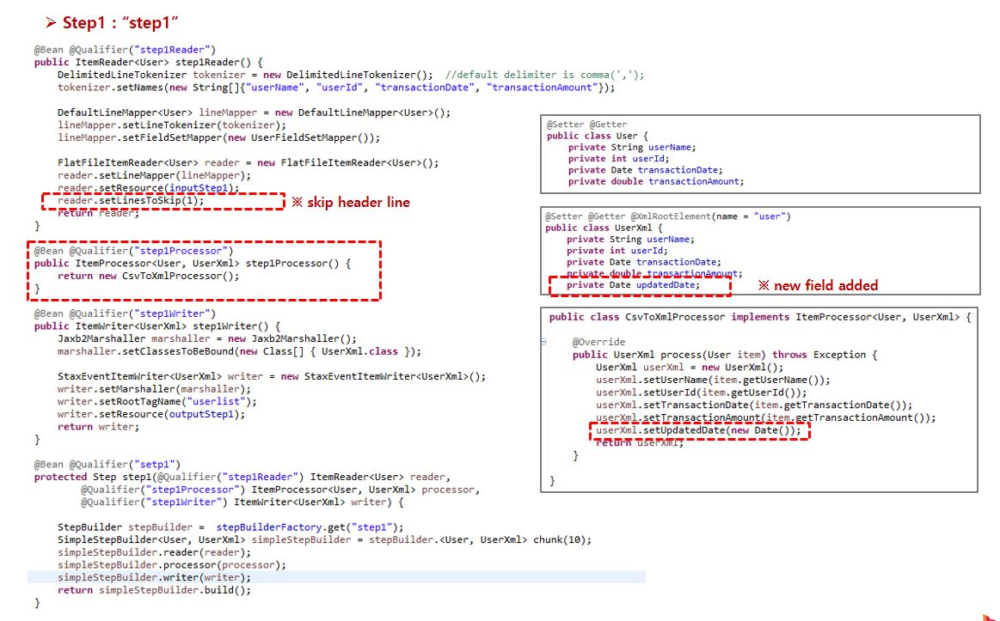
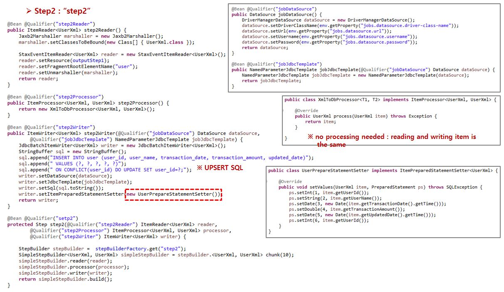
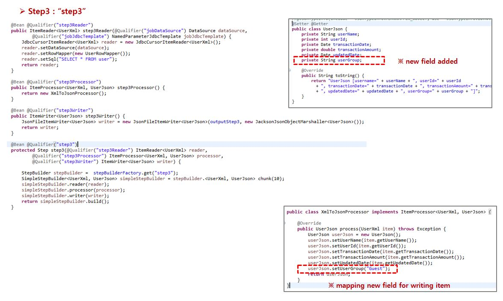
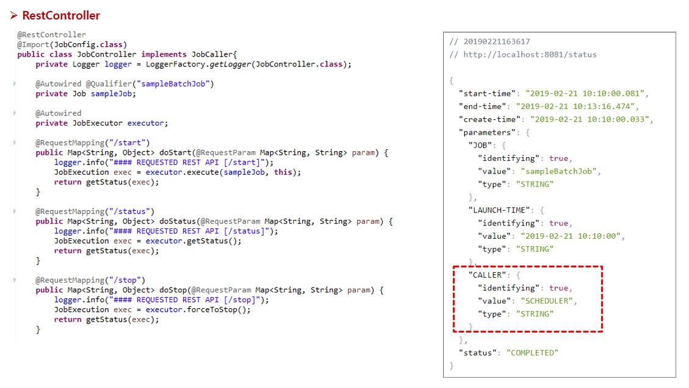

SpringBoot based Batch Job Example
==================================
# 1.Our Batch Job Scenario

## 1.1. Step1 : CSV file to XML file

## 1.2. Step2 : XML file to DB

## 1.3. Step3 : DB to Json file

# 2. Job Management(Rest API)

# 3. Your Implementation
## 3.1. Job Configuration Code

## 3.2. Application.yml

